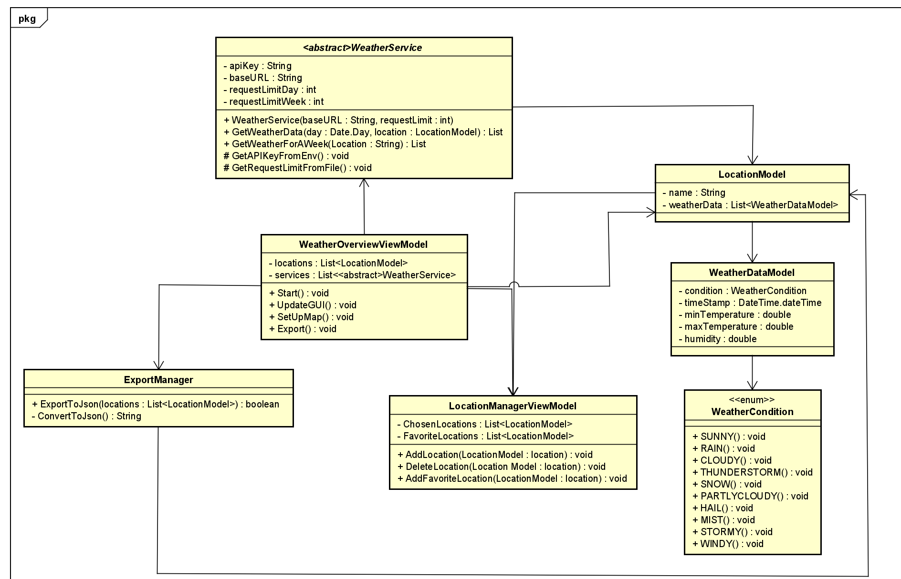

# Startdocument C# threading - Weerapplicatie

Startdocument van **Monique Sabong Land**, **Rick Vinke**, **Thijs Janse** en **Chris Klunder**.

## Applicatie Beschrijving
Voor het vak Threading in C# gaan wij een weerapplicatie voor in eerste instantie Nederland voor Windows maken.

De applicatie zal ontwikkeld worden met **C# .NET versie 8** en **.NET Maui**. 

## MosCow analyse
Must haves:
- De applicatie heeft een passende interface;
- Er wordt weerdata opgehaald van minstens één publieke API;
- Er wordt gebruik gemaakt van de hieronder genoemde threading manieren;
- Er wordt een kaart weergegeven met weergegevens;
- Je kan plaatsen instellen om weerdata in te zien;
- Er kan weerdata van verschillende dagen worden ingezien.

Should haves:
- Plaatsen kunnen als favoriet worden gemarkeerd;
- De applicatie heeft tabjes voor favoriete plaatsen;
- De applicatie heeft darkmode;
- De gemiddelde temperatuur van een plaats van de afgelopen week kan worden opgevraagd.

Could haves:
- Er wordt een pin geplaatst op de kaart voor favoriete plaatsen;
- Er worden pop-ups weergegeven met waarschuwingen;
- Er worden geluiden afgespeeld gerelateerd aan het weer;
- Er kan in- en uitgezoomd worden op de map;
- De applicatie is responsive.

Won't have:
- Er komt geen mobiele versie. 

## Threading manieren
- Multithreading: Voor het updaten van de weerdata op de kaart;
- Threadpool: Voor het cachen van weerdata op de achtergrond;
- Task Parellel Library (TPL): Voor het ophalen van weerdata op meerdere plaatsen tegelijk;
- Async & await: Voor het ophalen van de data van de API('s) en het laden van de verschillende pagina's in de applicatie.

## Klassendiagram

## Planning
Om de voortgang van dit project te bewaken, is er een planning gemaakt. Deze planning bevat in grote lijnen hetgeen waarmee wij ons bezig zullen houden per week tot de deadline. Er kan natuurlijk afgeweken worden van deze planning, maar het is het doel om deze in grote lijnen te volgen.

Dit project is begonnen op vrijdag 15 november 2024 en zal eindigen op vrijdag 23 april 2024.

## Literatuurlijst
- 
